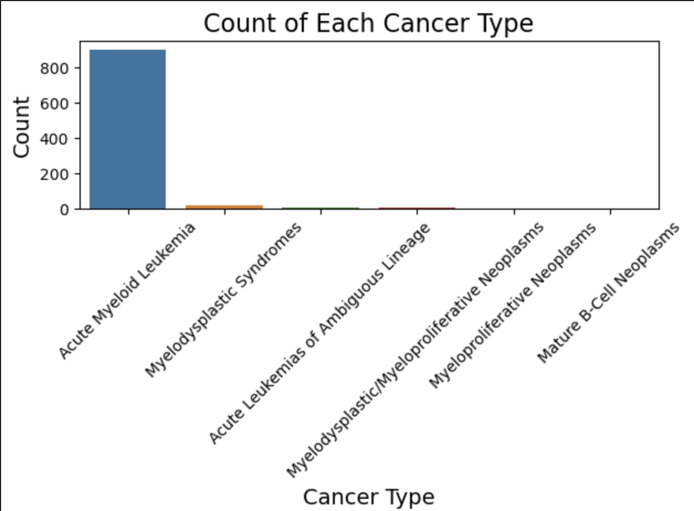
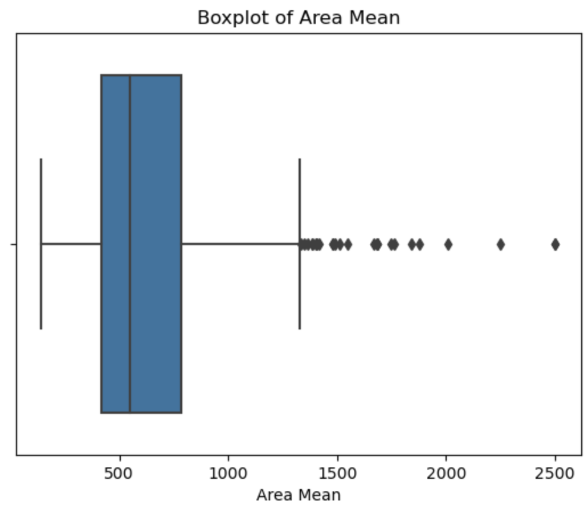
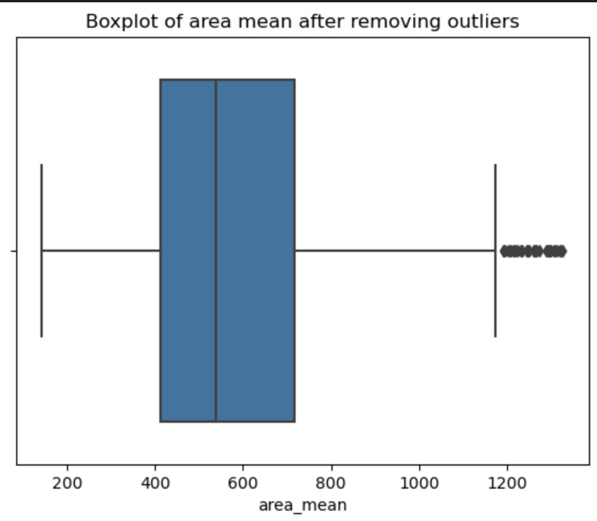
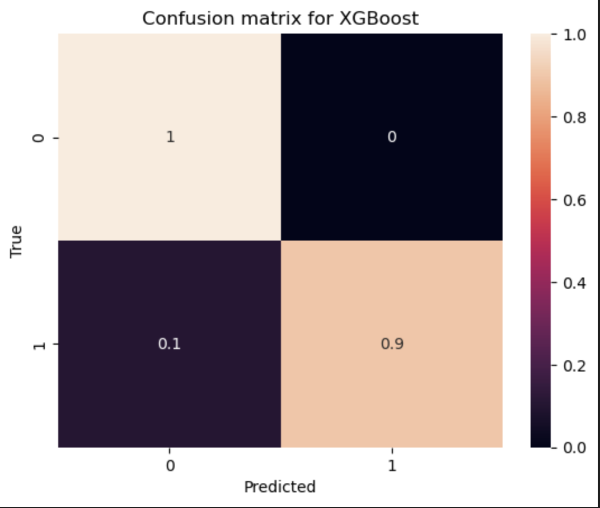
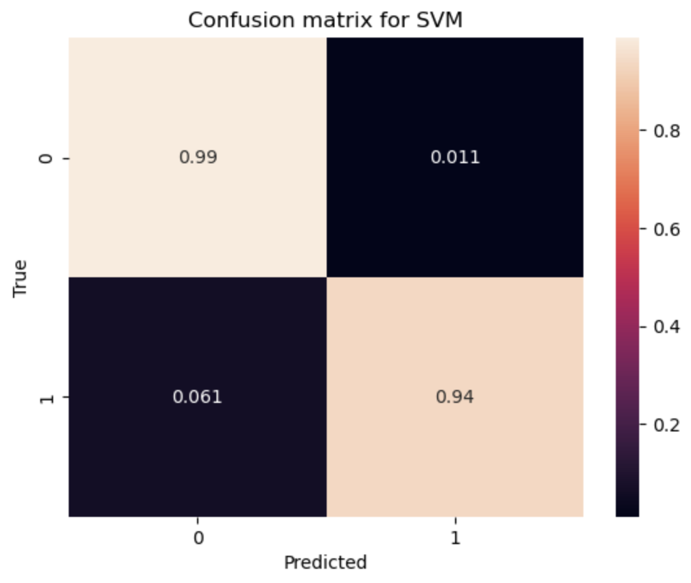
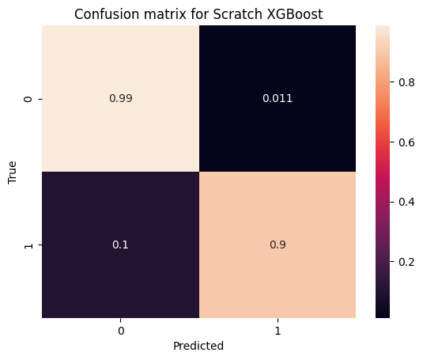
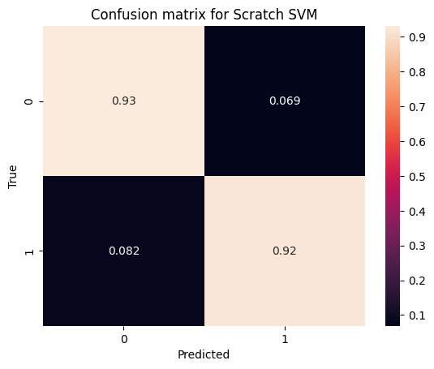

# CAS CS506 Final Project
Our final product is a web application through which users are able to get a prediction for the malignancy of their tumor, after inputting information from their fine needle aspirate (FNA). 

## Dataset 
### cBioPortal Dataset

Initially, we were planning on using the cBioPortal Data Acute Myeloid Leukemia set, which included information from many trials, including allele, gene, and white blood cell counts. From this data, we wanted to create and train a model that would best classify the type of cancer based on this information. We started by preprocessing the data: removing unnecessary columns, engineering different features, and creating data visualizations. However, after looking at the data visualizations, we realized that an overwhelming majority of the data set’s cancer type was Acute Myeloid Leukemia, as you can see below. Therefore, we decided it would not be very interesting for us to create and train a model on this data set since simply inferring that any trial would be Acute Myeloid Leukemia would already result in a very high accuracy. 
<!--  -->

### NEW Kaggle Dataset

Instead, we decided to pivot and look for another, somewhat related, dataset. After some research, we found a Kaggle Dataset that included information such as tumor size, area, and density. From this information, we hope to train a model that classifies the tumor as benign or malignant based on that information. In this data set, there is a much more evenly distributed split, with 63% benign and 37% malignant tumors, allowing us to better understand how to build a model to classify the data. 

## Preprocessing

### Detect Outliers
Outlier detection is the process of identifying data points that differ significantly from the majority of the data. These outliers can indicate variability in the data, measurement errors, or novel phenomena. Common methods for detecting outliers include using the Interquartile Range (IQR), where you calculate the first quartile (Q1) and the third quartile (Q3) of the data, compute the IQR by subtracting Q1 from Q3, and define the lower quartile as Q1 minus 1.5 times the IQR and the upper quartile as Q3 plus 1.5 times the IQR. Outliers are classified as data points that fall below the lower bound or above the upper bound. Additionally, box plot visualizations can be used to visually identify outliers. Outlier detection is essential for data preprocessing, as outliers can skew results and affect machine learning models' performance. By using methods like IQR, Z-score, visualizations, or machine learning algorithms, we could effectively detect and handle outliers in your dataset.
<!--  -->

<!--  -->

### Data Normalizing
We import the necessary scalers, select the number columns from the DataFrame numeric_df, and apply the StandardScaler to standardize the numeric features. This transforms the data to have a mean of 0 and a standard deviation of 1, which replaces the original values in the DataFrame. Additionally, there is a commented-out section that shows how to use MinMaxScaler to normalize the numerical features, scaling them to a range between 0 and 1. Finally, it prints the first few rows of the DataFrame after standardization to display the transformed data. In summary, this code preprocesses numeric features by scaling them, which can improve machine learning algorithms' performance.

### Feature Engineering
#### 1. Create a New Feature: Ratio of 'area_mean' to 'radius_mean'
This feature calculates the ratio of the mean area (area_mean) to the mean radius (radius_mean). This ratio can be useful for understanding tumor shape or size.

#### 2. Creating Interaction Features
This feature computes the product of the mean texture (texture_mean) and the mean radius (radius_mean). It represents the interaction between these two variables, which may provide better insights into the tumor characteristics.

#### 3. Mean Features Group Average and Standard Deviation
This step calculates the average (mean_features_avg) and standard deviation (mean_features_std) of several specified mean features. This helps in understanding the overall trends across multiple characteristics.

#### 4. Ratio of 'area_worst' to 'perimeter_worst'
This feature computes the ratio of the worst area (area_worst) to the worst perimeter (perimeter_worst). This can be useful for understanding the tumor shape.

#### 5. Variation between the Worst and Mean Values
For each specified feature, this step calculates the difference between the worst value and the mean value, creating a feature that represents variation. This indicates how much the tumor characteristics vary. This step uses LabelEncoder to convert the categorical feature 'diagnosis' into numerical values. Machine learning models need this preprocessing step to handle categorical data.

## Model Creation

### Splitting the Data
As the first step in our model creation, we split our data into the nexessary X_train, X_test, Y_train, and Y_test using train_test_split() from sklearn, which allows us to preserve the splits of data that we initially stated in our proposal. Then, we used these sets to create our XGBoost and SVC models.

### 1. XGBoost
The first model we created was XGBoost, using sklearn. We wanted to utilize XGBoost as one of our models due to its power and efficiency when it comes ot classification tasks. Additionally, we utilized the acuracy score and confusion matrix functions from sklearn to evaluate how well XGBoost ws classifying the data. With this model, we got an accurayc of around 0.96, also reflected in the confusion matrix, which indicated that XGBoost would be a good model for us to implement in our from-scratch portion.
<!--  -->

### 2. SVC
The next model we creater was SVC, using SVM from sklearn. We knew that SVM was a powerful model from class, and that SVC would be the best variations as our task in this poroject is a classification task rather than regression. For this, we also utilized sklearn's accuracy score and confusion matrix functions to evalutae accuracy. For SVC, we ot an accuracy of around 0.97, indicating that SVC was even more accuracte than XGBoost, and also a worthwhile model to implment.
<!--  -->

# Here is our midterm report presentation. Beyond this point is our progress after that

### Video Link: https://youtu.be/xuDXcFzg1y0 

## Custom Models 

### XGBoost 

#### Creation 
This code implements a simplified version of the XGBoost algorithm from scratch. It trains a set of decision trees iteratively, using gradient boosting to optimize predictions. Each tree corrects the residuals (errors) of the previous predictions. The class XGBoostFromScratch includes methods for training (fit), prediction (predict), and core functionalities like gradient and Hessian calculation, tree building, and gain computation. The goal of this implementation is to provide a foundational understanding of XGBoost's internal mechanics.

The fit method trains the model by iteratively adding trees. It begins by initializing predictions (y_pred) to zeros, representing the model's baseline prediction. For each iteration, it computes the gradient and Hessian to guide the tree-building process. 

The gradient (first derivative of the loss function) indicates the direction and magnitude of residual errors. For logistic loss (LogLoss), the gradient is calculated as:

**Gradient** = σ(ŷ) - y

Where:
- y: True label (0 or 1).
- ŷ: Model's raw output (logits).
- σ(ŷ): Sigmoid function, defined as:
  σ(ŷ) = 1 / (1 + e^(-ŷ))

This captures how much to adjust the prediction based on the difference between the predicted probability and the true label.

The Hessian (second derivative of the loss function) measures the curvature of the loss function, adjusting the gradient's step size for stable updates. For LogLoss, it is computed as:

**Hessian** = σ(ŷ) * (1 - σ(ŷ))

| Metric             | Formula                        | Purpose                                       |
|--------------------|--------------------------------|----------------------------------------------|
| Gradient (grad)    | σ(ŷᵢ) - yᵢ                    | Direction and magnitude of error for update. |
| Hessian (hess)     | σ(ŷᵢ) * (1 - σ(ŷᵢ))           | Adjusts step size for stability.             |

These values guide the tree-building process, ensuring that splits prioritize reducing the loss function. The _build_tree method recursively constructs decision trees by finding optimal splits using the `_find_best_split` method, which evaluates the potential gain from splitting on each feature and threshold. Once the tree is built, it is added to the model, and the predictions are updated by applying the learning rate to scale the tree's contribution. This process iteratively improves the model's predictions while preventing overfitting through hyperparameters like `max_depth` and `min_child_weight`.

The `_build_tree` method builds decision trees recursively up to the specified `max_depth`. Each node's split is determined by the `_find_best_split` method, which evaluates every feature and possible threshold in the dataset. It computes the gain, a metric that quantifies the improvement in the loss function from splitting the data. If the gain satisfies the `min_child_weight` constraint (a regularization term ensuring that splits are meaningful), the data is split into left and right child nodes, which are then processed recursively. If a node cannot be split further (e.g., due to depth limits or insufficient data), its value is calculated using _compute_leaf_value, which minimizes the loss for that node by considering the gradient and Hessian values. This recursive approach generates a binary tree that captures the relationships between features and the target variable.

The predict method makes predictions using the trained trees. It iterates over all trees, summing their contributions to compute the final predictions. Each tree’s prediction is computed using `_predict_tree`, a recursive method that traverses the tree based on the input data's feature values, eventually reaching a leaf node to retrieve its prediction value. For classification tasks, the predict method applies a threshold (default 0.5) to convert continuous predictions into binary outcomes. This thresholding ensures compatibility with metrics like accuracy, which require categorical outputs. By summing the contributions from all trees and scaling them with the learning rate, the model balances the complexity of each tree and the cumulative effect of multiple trees to make accurate predictions.

#### Hyperparameter Finetuning
| Parameter         | Description                                                                                   | Default Value | 
|-------------------|-----------------------------------------------------------------------------------------------|---------------|
| `n_estimators`    | The number of trees (boosting rounds) to train.                                               | 100           | 
| `learning_rate`   | Shrinks the contribution of each tree. Balances model complexity and training iterations.     | 0.1           | 
| `max_depth`       | Maximum depth of a tree. Controls tree complexity and prevents overfitting.                   | 3             |
| `lambda_`         | L2 regularization term. Penalizes large weights to prevent overfitting.                       | 1             | 
| `min_child_weight`| Minimum sum of Hessian (second derivative) in a child node to allow splitting.                | 1             | 
| `gamma`           | Minimum loss reduction required to split a node. Prevents overfitting by avoiding trivial splits. | 0             | 
| `trees`           | Stores the trained decision trees. Used internally during prediction.                         | None          | 

#### Hyperparameter Tuning Range

| **Parameter**       | **Values**               |
|----------------------|--------------------------|
| `max_depth`    | 3, 5, 7                  |
| `min_child_weight`| 1, 3, 5                  |
| `learning_rate`  | 0.01, 0.1, 0.2           |
| `n_estimators`    | 50, 100, 200             |
| `lambda_`        | 0, 0.1, 1, 10            |
| `gamma`          | 0, 1, 5                  |

#### Final Result:
Before hyperparameter tuning, the model's accuracy was **0.9338**, which improved to **0.9559** after tuning. Although the improvement seems slight, when compared to the accuracy of **0.9632** achieved by the XGBoost package's built-in implementation, it demonstrates a significant improvement for a custom implementation like ours.

| **RESULT**      | `max_depth`             | `min_child_weight` |  `learning_rate` | `n_estimators`  | `lambda_` | `gamma`
|----------------------|-----------------|-----------------------|-------------------------|-------------------|-------------------|------------------|
| **Values**     |     7            | 3| 0.1| 200| 0| 0

#### Reasons for Accuracy Improvement

The improvement in accuracy can be attributed to the following adjustments:

1. **Deeper Trees (`max_depth=7`)**  
   Increasing the tree depth allows the model to capture more complex patterns in the data. This can lead to better splits and more accurate predictions, especially for non-linear relationships.

2. **Smaller `min_child_weight` (3)**  
   Reducing the minimum child weight enabled the model to create splits even when fewer instances were present in a leaf. This helped the model better handle small but significant segments of the data.

3. **Moderate Learning Rate (`learning_rate=0.1`)**  
   A balanced learning rate allows the model to converge steadily, preventing overfitting while still making meaningful updates in each boost round.

4. **Increased `n_estimators` (200)**  
   Added more trees provided the model with additional opportunities to correct residual errors, enhancing overall performance.

5. **No Regularization (`lambda_=0`, `gamma=0`)**  
   Disabling regularization parameters indicates that the data was sufficiently clean and the model complexity was manageable without additional constraints.

These tuned parameters collectively allowed the model to achieve a balance between complexity and generalization, leading to a noticeable performance improvement.

### SVM 
#### Creation
In order to more easily tune the model to our data, we decided to implement our own custom SVM model. This SVM class is designed to perform a binary classification using a linear decision boundary that maximizes the margin between the classes. ​​Our implementation takes advantage of key hyper parameters such as the learning rate, regularization parameter, and the number of iterations, making them all configurable through the class constructor. Additionally, we initialize the weights and bias to zero before training, allowing the algorithm to iteratively learn the optimal weights and bias through gradient descent optimization to minimize the hinge loss function. This is a common loss function that balances the trade-off between maximizing the margin and minimizing classification errors.

To implement our model, the first main method needed was the fit method, where the model is trained on input data X and classifications y, similar to sci-kit learn’s SVC class. Our fit function first processes y to ensure labels are classifiers, either -1 or 1, making the data set valid for SVM classification. This method then uses a nested loop, going through each of the training samples for each of the specified number of iterations. For each sample, the model checks a condition based on the margin and updates weights and bias accordingly, and when satisfied, the weights are updated to minimize regularization. Otherwise, the updates also consider the hinge loss, adjusting the values to correctly classify the sample while respecting the margin constraint. Through this iterative approach, the model is able to converge toward an optimal hyperplane that separates the two classes effectively.  

Finally, the predict method uses the learned weights and bias to classify new samples by taking the sign of the linear combination of the input features and the weights and bias. It computes the decision function for each sample in X and applies the sign function to assign class labels of either -1 or 1, which ensures that the model will classify data into either of these two categories, -1 and 1. The example in the `__main__`  block demonstrates the functionality with a toy dataset, where the SVM is trained and then used to predict labels for the same data. This code provides a clear and concise implementation of a linear SVM, showcasing essential concepts in machine learning such as hinge loss optimization, regularization, margin maximization, gradient descent, and the relation between them.

#### Tuning 
###### Parameter Explanations

| **Parameter**       | **Purpose**                                                                                   | 
|----------------------|-----------------------------------------------------------------------------------------------|
| `learning_rate`     | Controls the step size in weight updates during gradient descent.                             | 
| `C`                 | Regularization parameter. Balances margin maximization and classification error minimization. |
| `n_iters`           | Number of iterations for training. Determines how long the gradient descent runs.             | 

These parameter settings were chosen to optimize the SVM's performance while maintaining computational efficiency.

##### Hyperparameter Tuning Range
| **Parameter**      | **Values Tried**         | **Final Selected Value** |
|---------------------|--------------------------|---------------------------|
| `learning_rate`    | [0.00001, 0.0001, 0.001, 0.01]       | 0.00001                     |
| `C`                | [0.1, 1, 10, 100]        | 10                         |
| `n_iters`          | [100, 500, 1000, 2000]       | 100                     |

#### Final Result:
Before hyperparameter tuning, the model's accuracy was **0.36029**, which improved to **0.92647** after tuning. Although the improvement seems slight, when compared to the accuracy of **0.970588** achieved by the SVC package's built-in implementation, it demonstrates a significant improvement for a custom implementation like ours.

| **RESULT**      | `learning_rate`             | `C` |  `n_iters` | 
|----------------------|-----------------|-----------------------|-------------------------|
| **Values**     |     0.00001            | 10 | 100|

- **Before tuning**: Accuracy was **36.03%**. The model struggled with imbalanced predictions, often biasing results toward one class.
- **After tuning**: Accuracy improved to **92.65%** due to the optimal combination of parameters:

1. **Learning Rate**:  
   - The default value of `0.001` caused overshooting during weight updates.  
   - Lowering it to `0.00001` allowed finer adjustments, leading to better convergence.

2. **C Parameter**:  
   - Increasing `C` to `10` reduced tolerance for margin errors.  
   - The model prioritized correctly classifying points near the decision boundary, improving sensitivity to subtle patterns.

3. **Iterations**:  
   - Excessive iterations (high `n_iters`) in earlier settings caused the model to predict only benign results.  
   - Limiting iterations to `100` prevented over-adjustments, stabilizing the decision boundary.

4. **High Iterations Leading to All Benign Predictions**:  
   - With excessive iterations, weights were updated too many times, skewing the decision boundary.  
   - This resulted in predictions biased toward one class (e.g., benign), which artificially inflated accuracy in imbalanced datasets.

5. **Low Learning Rate and Limited Iterations**:  
   - Reducing the learning rate to `0.00001` ensured incremental weight adjustments, avoiding drastic changes.  
   - Coupled with fewer iterations, the model balanced sufficient learning with minimal overfitting.

6. **Importance of C Parameter**:  
   - A higher `C` value prioritized minimizing classification errors near the margin, avoiding oversimplified decision boundaries.  
   - This enhanced the model’s ability to classify challenging cases more accurately.

The significant jump in accuracy demonstrates the importance of careful hyperparameter tuning. By balancing precision (via learning rate), flexibility (via `C`), and stability (via iterations), the tuned SVM achieved **92.65% accuracy**, competing closely with SVC's **97.05% accuracy**. This highlights the strength of the custom SVM implementation when properly optimized.

### Final Accuracy 
| **Model**      | `SVM Scratch`             | `SVC Package` |  `XGBoost Scratch` | `XGBoost Package`  | 
|----------------------|-----------------|-----------------------|-------------------------|-------------------|
| **Accuracy**     |      0.92647      |0.970588 |0.9559 | 0.9632|
## Web Application 
 
### Functionality 

### Significance 

## Duplicate our code
Creating a virtual environment to install packages in Python app development instead of modifying the system-wide environment will allow you to seperate packages.

#### How to start Python Application with Python Environment
##### 1. Install `make install`

If you system does not have `venv` library, install it using apt.
>   
    sudo apt install python3-venv

##### 2. Navigate to the project directory where you want to create a virtual environment and install the required packages for our python Application

##### 3. Run the 'make install' command in your designated directory
>
    make install

##### 4. Run the 'make run' command in your designated directory to start the GUI application
>
    make run

##### 5. Activate the virtual environment:
* For Mac
>   
    source myenv/bin/activate
  
* For Window
  * For Command Prompt:
    >
        myenv\Scripts\activate
  * For PowerSehll:
    >
        .\myenv\Scripts\Activate

After activation, you should see '(myenv)' at the beginning of your terminal prompt.

##### 6. Deactivate the virtual enviornment, run:
>
    deactivate

### Requirements.txt
The `requirements.txt` file should list all the Python libraries that these code files require, and the libraries will be installed by:
>
    pip install -r requirements.txt

In the Makefile the requirements installcation is included.